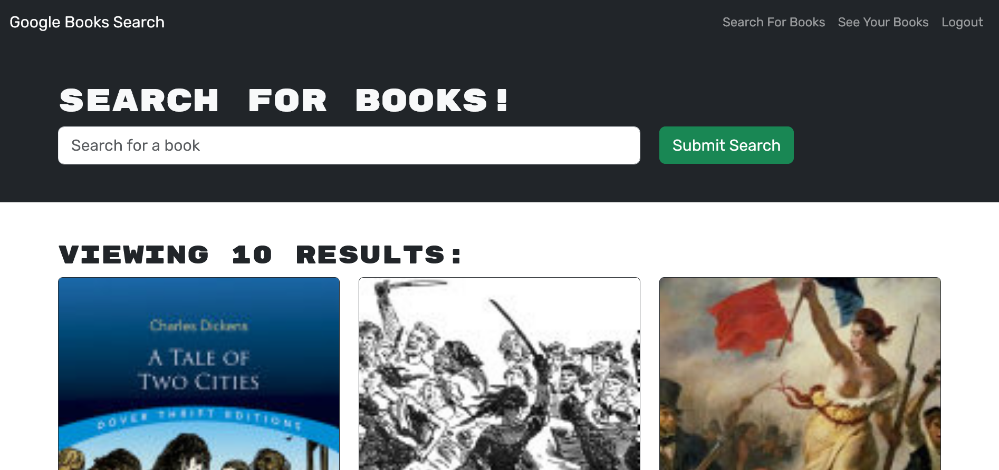

# Book Search Engine Graphql Refactorization

## Description

This is a simple book search engine app. It came in functional with a rest API, and I refactored it tp use Apollo and graphql. Authentication is provided by using Json Web Tokens.

## Usage

The site is pretty simple. If the user is not logged in, they can still search for books. They put a book title in the search bar, press the Submit Search button, and if such books exist, ten options will show up. Each one includes a picture of the cover (if it exists), the title, the author(s) if known, and a description of the book. 

The user can create an account by clicking the login link. It leads to a modal giving the user the option to either sign up or log in. If the user chooses to sign in, they are prompted for a username, email and password. Once those are provided and submitted the user is created and logged in automatically. If the user is just logging in, they need only submit their email and password. If they are correct the user logs in.

If the user is logged in, they have an additional link in which to see their saved books. On the main page, each book option now has a button that, when clicked, saves the book to the user's account. When they then go to the "saved books" page, they can see their saved books. They also have the option to delete any of their saved books, which just removes them from the list.

## Link

Visit the site here:
https://nathan-book-search-engine-4b55d02e4462.herokuapp.com/

## Notes

Some code was borrowed from Max Rice on the back end, and a lot of it was available on the class recording. The rest of the code is my own.

